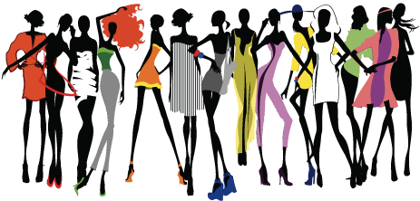

## The Fashion Industry & The Water Crisis

In the last years there has been an increasing focus on conscious living and more sustainable choices. However, there seems to be still many people who don't know how they can contribute to a cleaner environment and how their choices as consumers impact the eco-systems. The fashion industry is the second largest water-consuming industry worl-wide.
In my school semester assignment I focused on researching this issue, ideating, realizing and testing a possible solution.

This case study was conducted at half of my UX Design course and it offered me a great opportunity to apply my competences. It was a great learning bases, and since then I have learned much more on how to work more effectively.

You can access this case study by clicking the link below.

[Water&Fashion](Water&Fashion.pdf)

## Research & Insights

In UX Design the main focus is on how to improve people's lives by offering better solutions to real-life problems. Therefore, the most important step in the UX Design process is to understand the user and what his root-problem is.

Albert Einstein said it best "If I had an hour to solve a problem I’d spend 55 minutes thinking about the problem and five minutes thinking about solutions." Solutions can always be worked and improved upon, but there is obviously no use for a solution of a non-existing problem.

Here is a case study I did at the beginning of my UX Design course that primarily focused on this first design process step.

[UX-Research](UX-Research.pdf)

## Ideation & Planning

To offer the highest possible value in the work we do as designers we need to strive to find original, better solutions than those already existent.
If a problem is relevant enough, it is highly probable that someone has already tried to come up with a solution to solve it. As designers, we can take inspiration
from the existing ideas, but we need to find ways to improve upon them and not just offer another equally-worthy alternative.

Good ideas are the product of a mix of different assets such as creativity, knowleadge, inspiration and method. 

In the case study below I worked on solving the problem of loneliness among young people in Norway by defining what the main issue was and trying to ideate possible solutions.

https://drive.google.com/file/d/10VqYGsGkiNusdJeFcIqxbT7s2Nz2uGgW/view?usp=sharing

## Wireframes & Prototypes

Realizing a product requires massive resources in terms of time, energy and money and it usually involves a team. In past it was common to follow the waterfall work-methodology
which consisted of following a chronological, straigh-forward work method. That method of work can be beneficial in some instances, but can also lead to massive wastes of time and efforts when for example a team realizes that the product they've been working all along doesn't actually satisfy the market requests.

The agile methodology consists in working in short sprints, during which the team continously undertakes research and test their idea along all the realization process.
This is very beneficial, because it allows for changes along the way without wasting energy in dead-ends.

To know if an idea has potential and is worth working upon, it is necessary to test it and see how well it performs practically with real people. Therefore it is fundamental
for designers to know how to realize wireframes and prototypes that can be used during testing. 

I have knowleadge and experience working with the most common prototypes tools, such as Adobe XD, Figma and Illustrator.
Below there is a study case I have done where I realized a high-fidelity prototype for a health-coach app. 

[UX-Prototype](UX-Prototype.pdf)

--------------------------------------------------------------------------------------------------

## Illustrations

On a side note, I am really passionate about arts as well. I have always loved to draw, paint and express myself visually.
Recently I have begun to learn and realize some digital illustrations. It is something I am passionate about and enjoy doing even as just of a hobby.
Although, I think it can be useful in my job as a designer in many occasions as well. It is a perfect win-win case for me!

I can do simple illustrations using Adobe programs, both static and simply animated (for example animated GIFS). Below it is an overview of some of my work.

&nbsp

